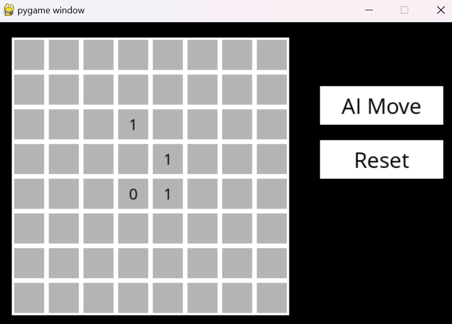

# CS50 AI Projects Repository

This repository contains a collection of projects completed as part of the **CS50's Introduction to Artificial Intelligence with Python** course, focusing on artificial intelligence techniques and their applications in various problem domains. Each project applies different AI algorithms, including search algorithms, probabilistic models, and neural networks.

## Table of Contents

- [1. Attention](#1-attention)
- [2. Crossword](#2-crossword)
- [3. Degrees](#3-degrees)
- [4. Heredity](#4-heredity)
- [5. Knights](#5-knights)
- [6. Minesweeper](#6-minesweeper)
- [7. Nim](#7-nim)
- [8. PageRank](#8-pagerank)
- [9. Parser](#9-parser)
- [10. Shopping](#10-shopping)
- [11. Tic-Tac-Toe](#11-tic-tac-toe)
- [12. Traffic Sign Recognition](#12-traffic-sign-recognition)

---

## 1. Attention

In this project, the goal is to implement and analyze **Attention mechanisms** in neural networks. Attention allows the model to focus on specific parts of input data, improving accuracy and interpretability in tasks like sequence-to-sequence models.

Given the input:
```
The turtle slowly moved across the [MASK].
```

The model might predict:
```
The turtle slowly moved across the road.
The turtle slowly moved across the ground.
The turtle slowly moved across the field.
```

## 2. Crossword

This project generates and solves a **crossword puzzle** using constraint satisfaction problems (CSP). It employs backtracking search and arc consistency to fill the puzzle grid with the correct words.


## 3. Degrees

The **Degrees of Separation** project uses breadth-first search (BFS) to determine the shortest path between two actors based on their movie co-appearances, visualizing how actors are connected in the "Hollywood network."

```
Name: Tom Hanks
Name: Kevin Bacon
Loading data...
Data loaded.
2 degrees of separation.
1: Tom Hanks and Meg Ryan starred in Sleepless in Seattle
2: Meg Ryan and Kevin Bacon starred in In the Cut
```

## 4. Heredity

This project involves **Bayesian networks** to calculate the probability of genetic traits being passed down from one generation to the next. It uses probabilistic inference to predict traits based on a family tree.


## 5. Knights

A **logical puzzle** where a group of knights and knaves must be identified based on their statements. Knights always tell the truth, and knaves always lie. The project uses propositional logic and knowledge-based reasoning to solve the puzzle.

```
Puzzle 0
    A is a Knave
Puzzle 1
    B is a Knight
Puzzle 2
    A is a Knight
    B is a Knave
Puzzle 3
    C is a Knave
```

## 6. Minesweeper

A Python implementation of the classic game **Minesweeper** with an AI agent that uses logical inference to make safe moves. The AI models knowledge of the game grid to avoid mines and win.



## 7. Nim

An AI that learns to play **Nim**, a game where players take turns removing objects from piles. The AI uses **reinforcement learning (Q-learning)** to improve its strategy over time by playing against itself.

```
Playing training game 1
...
Playing training game 10000
Done training

Piles:
Pile 0: 1
Pile 1: 3
Pile 2: 5
Pile 3: 7

Your Turn
Choose Pile: 2
Choose Count: 3

AI's Turn
AI chose to take 2 from pile 3.

Piles:
Pile 0: 1
Pile 1: 3
Pile 2: 2
Pile 3: 5
```

## 8. PageRank

This project implements the **PageRank algorithm**, the backbone of search engines, to rank web pages based on their importance. It simulates how Google's search algorithm ranks pages by analyzing the link structure of the web.

```
PageRank Results from Sampling (n = 10000)
  1.html: 0.2323
  2.html: 0.3114
  3.html: 0.4563

PageRank Results from Iteration
  1.html: 0.2301
  2.html: 0.3142
  3.html: 0.4557
```

## 9. Parser

This project implements a natural language processing (NLP) system to parse sentences and determine their grammatical structure using context-free grammars (CFG). The system identifies parts of speech and analyzes sentence syntax.

Input:
```
Sentence: Holmes smiled and sat in the armchair.
```

Output:
```
                  S                    
        __________|__________          
       |                     VP       
       |         _____________|___     
       NP       |                 VP  
  _____|____    |              ____|__ 
 N         V    V             P       NP
 |         |    |             |    ___|____
holmes   smiled and          sat  in the armchair

Noun Phrase Chunks
holmes
the armchair
```

## 10. Shopping

A machine learning project that predicts whether customers will make a purchase from an online shopping website. It uses various supervised learning algorithms to classify the likelihood of a customer buying based on their browsing behavior.

```
Correct: 1200
Incorrect: 400
True Positive Rate: 85.00%
True Negative Rate: 70.00%
```

## 11. Tic-Tac-Toe

A game-playing AI that uses the **Minimax algorithm** to play **Tic-Tac-Toe** optimally. The AI ensures that it never loses and tries to win whenever possible by evaluating future game states.


## 12. Traffic Sign Recognition

A **convolutional neural network (CNN)** trained to recognize **traffic signs** from images. The model is trained on a dataset of traffic sign images and uses image processing techniques to classify signs correctly.


---

## Installation

1. Install required Python packages:
   ```bash
   pip install -r requirements.txt
   ```

## Usage

Each project is contained in its own directory. Follow the `README.md` files within each project directory for specific instructions on how to run the code and use the models.